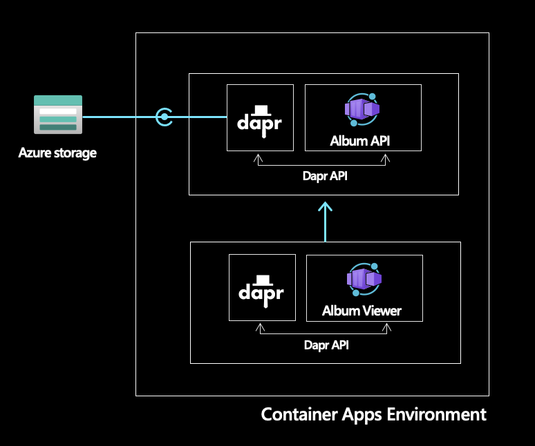

# Azure Container Apps: Dapr Albums Sample

This repository was created to help users quickly deploy Dapr-enabled microservices to Azure Container Apps.

## Solution Overview

The solution is composed of two microservices: the album API and the album viewer.

#### Album API (`album-api`)

The [`album-api`](./album-api) is an .NET 6 minimal Web API that retrieves a list of Albums from Azure Storage using the Dapr State Store API. Upon running the application for the first time the database will be seeded. For subsequent calls, the list of albums will be retrieved from the backing state store.

#### Album Viewer (`python-app`)

The [`album-viewer`](./album-viewer) is a node application through which the albums retrieved by the API are surfaced. In order to display the repository of albums, the album viewer microservice uses the Dapr Service invocation API to contact the backend album API.

## Deploy via GitHub Actions

The entire solution is configured with [GitHub Actions](https://github.com/features/actions) and [Bicep](https://docs.microsoft.com/azure/azure-resource-manager/bicep/overview) for CI/CD

1. Fork the sample repo
2. Create the following required [encrypted secrets](https://docs.github.com/en/actions/security-guides/encrypted-secrets#creating-encrypted-secrets-for-a-repository) for the sample
   | Name | Value |
   | ----------------- | ------------------------------------------------------------------------------------------------------------------------------------------------------------------------------------------------------------------------------------------------------------------------------------------------------- |
   | AZURE_CREDENTIALS | The JSON credentials for an Azure subscription. Replace the placeholder values and run the following command to generate the Azure authentication information for this GitHub secret `az ad sp create-for-rbac --name INSERT_SP_NAME --role contributor --scopes /subscriptions/INSERT_SUBSCRIPTION_ID --sdk-auth`. For guidance on adding a secret, [see here](https://docs.microsoft.com/azure/developer/github/connect-from-azure?tabs=azure-portal%2Cwindows#create-a-service-principal-and-add-it-as-a-github-secret) |
   | RESOURCE_GROUP | The name of the resource group to create |
   | GH_PAT | [Generate a GitHub personal access token with `write:packages` permission](https://docs.github.com/en/authentication/keeping-your-account-and-data-secure/creating-a-personal-access-token) and store as a pipeline secret. This PAT will be used to push images to your private GitHub Package Registry.  |

3. Open the Actions tab, select the **Build and Deploy** action and choose to run the workflow. The workflow will build the necessary container images, push them to your private Github Package Registry and deploy the necessary Azure services along with two Container Apps for the respective services.

4. Once the GitHub Actions have completed successfully, navigate to the [Azure Portal](https://portal.azure.com) and select the resource group you created. Open the `album-viewer` container app and browse to the FQDN displayed on the overview blade. You should see the sample application up and running.

## Build and Run

[Click here for instructions on building and running the application locally](build-and-run.md)
